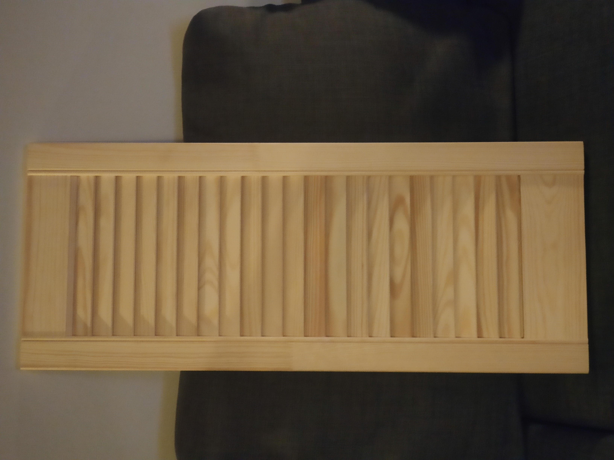
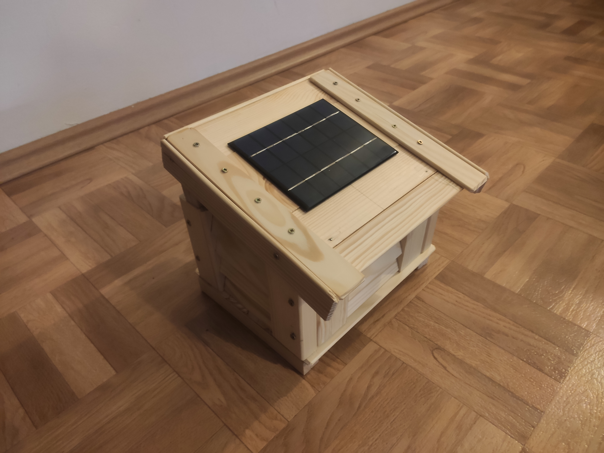

# Smogometr z czujnikami środowiskowymi
Celem projektu jest zaprezentowane możliwości płytki deweloperskiej [OTN](https://github.com/Open-Things-Network/lora-dev-board/tree/master/v1.0) oraz zbudowanie prostej klatki meteorologicznej. Zadaniem urządzenia jest pomiar pyłu zawieszonego (PM10 i PM2,5), temperatury, ciśnienia, wilgotności oraz natężenia światła i wysłanie danych używając technologii LoRa.

## Zastosowane urządzenia
 * Arduino Pro Mini (odpowiednik) - 3,3V ATmega328P
 * Moduł radiowy LoRa 868MHz
 * Moduł GY-302 z czujnikiem oświetlenia BH1750
 * Czujnik ciśnienia, wilgotności i temperatury Bosch BME280
 * Czujnik pyłu zawieszonego Nova Fitness SDS011
 * Moduł przetwornicy DC-DC Step-up 2.5..5V - 5V U3V12F5
 * Akumulator Li-Po Akyga 3,7V/500mAh
 * Panel słoneczny 136 x 110 mm o mocy 2W
 * Antena 868MHz ze złączem U.FL

## Biblioteki do czujników
 * [Adafruit BME280 Library by Adafruit](https://github.com/adafruit/Adafruit_BME280_Library)
 * [BH1750 by Christopher Laws](https://github.com/claws/BH1750)
 * [SDS by OTN](https://github.com/Open-Things-Network/workshops/tree/master/smogometr/libraries/sds)

## Budowa klatki meteorologicznej
Klatka meteorologiczna została zbudowana na bazie drewnianych drzwiczek ażurowych i desek dostępnych w markecie budowlanym. Klatka wymaga zwiększenia kąta nachylenia dachu, na którym umieszczony zostanie panel słoneczny oraz zabezpieczenie jej powierzchni przed deszczem i wilgocią.

Przed:
 

Po:
 

## [Dodatkowe zdjęcia](media/)

