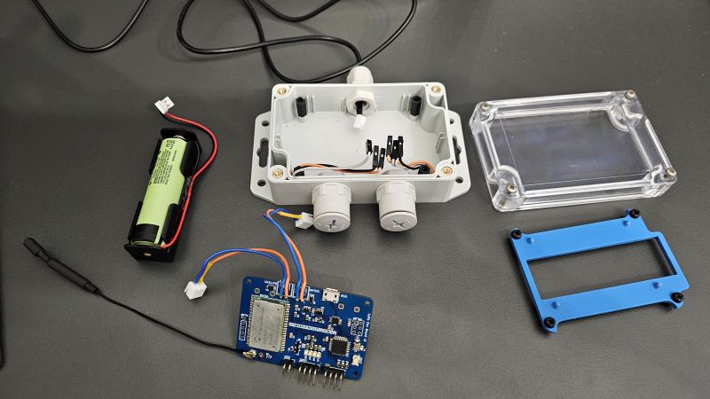

# Stacja pogody

*For English version go [here](Readme_eng.md)*

Projekt bazuje na kodzie napisanym na platformie arduino w pliku `weather-station.ino`. Wykorzystuje wersję v2.0 płytki PCB.
Aby skonfigurować projekt należy edytowac zmienne `appEui` oraz `appKey` zgodnie z ustawieniami sieci TTN. Transceiver będzie korzystał z trybu OTAA.

## Kompilacja i wgrywanie

Kompilację projektu wykonuje się poprzez Arduino IDE. Aby wgrać kod na płytkę należy skorzystac z gniazda USB znajdującego się na płytce PCB.

## Obudowa

Lista części: 
- Obudowa: Kradex Z128
- Panel słoneczny: DFRobot FIT0601
- Czujniki: DS18B20 & BME280
- Bateria: Panasonic NCR18650B
- Inne części:
    - Dławnice kablowe M12 x3
    - Dystanse 12 mm x4
- Antena: 868 Mhz w kształcie sprężyny ze złączem U.FL.

Dodatkowo potrzebny jest wydruk 3D, na którym umieszczona jest płytka PCB wewnątrz obudowy (niebieska część na zdjęciu).

## Złożenie

1. Usuń wzystkie wypustki z obudowy, które będą przeszkadzały w umieszczeniu dławnic w obudowie.
2. Zrób otwory pod dławnice (jak na zdjęciu powyżej). W nakrętkach dławnic wywierć otwory, aby powietrze mogło się dostać do czujników.
3. Umieść dystanse w obudowie.
4. Umieść dławnice w obudowie. Wewnątrz nich umieść czujniki, będzie wystarczająco miejsca nawet na BME280.
5. Włóż baterię na spód obudowy.
6. Przykręć wydrukowaną część do dystansów.
7. Umieść płytkę PCB.
8. Poprowadź kable w sposób umożliwiający zamknięcie obudowy.

