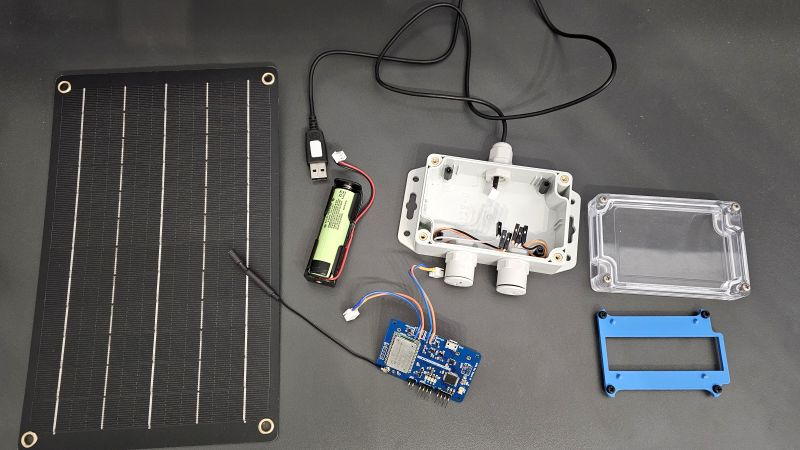
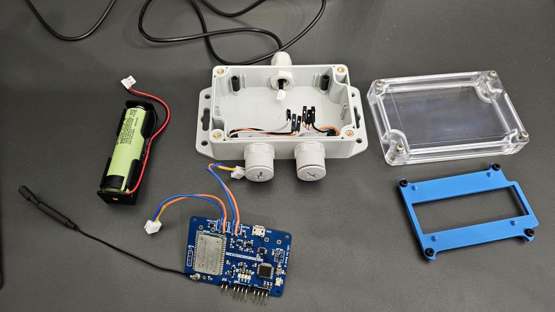
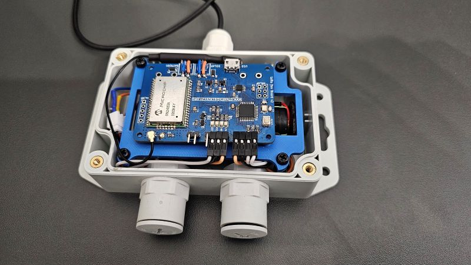

# Weather station

Project is based on the Arduino code and placed in the `weather-station.ino`. It uses version v2.0 of the hardware.
To configure the project edit `appEui` and `appKey` variables according to TTN settings. The tranceiver will work in the OTAA mode.

## Compiling and uploading

To compile follow the standard procedure of Arduino IDE.
To upload plug the usb cable into pcb and upload the code from Arduino IDE.

## Case

Parts list:
- Case: Kradex Z128
- Solar panel: DFRobot FIT0601
- Sensors: DS18B20 & BME280
- Battery: Panasonic NCR18650B
- Other parts:
    - Cable glands M12 x3
    - PCB spacers 12 mm x4
- Antenna: 868 Mhz spring antenna with U.FL connector.

In addition, there is a 3D print that secures PCB inside the case (blue part on the picture).

## Assembly

The process of assembly is quite easy, but some modifications must be made: 

1. Get rid of Kradex's unnecessary tabs, that will interfere with cable glands.
2. Make holes for cable glands. Make a hole in the glands' nut to provide air to sensors.
3. Mount the spacers.
4. Mount the cable glands. Place sensors inside them, there will be enough space even for the BME
5. Place the battery at the bottom.
6. Place the 3D-printed base onto the spacers and screw it in place.
7. Place the PCB.
8. Route the cables.

