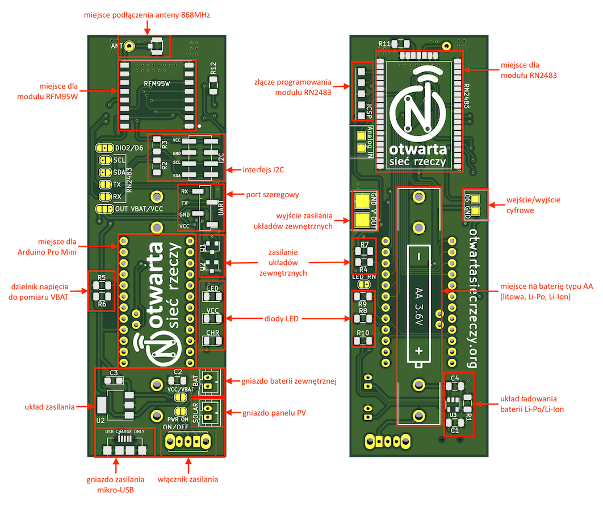

# v1.0

# Spis treści:
1. [Opis płytki](#Opis-płytki)
2. [Arduino Pro Mini](#Arduino-Pro-Mini)
3. [Interfejs LoRaWAN](#Interfejs-LoRaWAN)
4. [Układ zasilania](#Układ-zasilania)
5. [Układ ładowania](#Układ-ładowania)
6. [Diody LED](#Diody-LED)
7. [Interfejsy komunikacyjne](#Interfejsy-komunikacyjne)
8. [Pomiar napięcia baterii](#Pomiar-napięcia_baterii)
9. [Sterowanie zasilaniem układów zewnętrznych](#Sterowanie-zasilaniem-układów-zewnętrznych)
10. [Zworki](#Zworki)
11. [Lista elementów](#Lista-elementów)
12. [Uwagi](#Uwagi)

# Opis płytki
Możliwe warianty konfiguracji:
1. Arduino Pro Mini i RFM95W 
2. Arduino Pro Mini i RN2483A
3. RN2483A

Szczegółowe instrukcje dla wersji montażowych:
* Wersja minimalna [doc/A_minimal.md](doc/A_minimal.md)

## Arduino Pro Mini
Platforma współpracuje z modułami [Arduino Pro Mini](https://github.com/sparkfun/Arduino_Pro_Mini_328) lub ich klonami w obu wariantach (3.3V/8MHz i 5V/16MHz).
> **UWAGA!** Do programowania potrzebny jest konwerter USB/Serial.

## Interfejs LoRaWAN
Płytka pozwala na realizację interfejsu LoRaWAN na dwa różne sposoby:
* wykorzystanie modułu nadajnika-odbiornika LoRa [RFM95W](https://www.hoperf.com/modules/lora/RFM95.html) i implementacja stosu LoRaWAN na mikrokontrolerze - komunikacja z modułem poprzez SPI (piny 11, 12 i 13 Arduino Pro Mini)
* zastosowanie modułu z wbudowaną obsługą stosu LoRaWAN [RN2483A](https://www.microchip.com/wwwproducts/en/RN2483) - komunikacja z modułem poprzez port szeregowy obsługiwany programowo (piny 6 (RX) i 7 (TX) Arduino Pro Mini).

## Układ zasilania
Zastosowany regulator napięcia LDO [TS2940CW33](https://www.taiwansemi.com/en/products/details/TS2940CW33).
* Maksymalne napięcie zasilania - 26V
* Minimalne napięcie zasilania - 3,5V
* Spadek napięcia dla prądu 100mA - 100mV, 800mA - 600mV
* Napięcie wyjściowe - 3.3V
* Prąd maksymalny - 1A

## Układ ładowania
Zastosowany kontroler ładowania akumulatorów litowo-polimerowych (Li-Po) i litowo-jonowych (Li-Ion) [MCP73831](https://www.microchip.com/wwwproducts/en/en024903#additional-features).
* Maksymalne napięcie zasilania - 6V
* Minimalne napięcie zasilania - 3.75V
* Napięcie ładowania - 4.2V
* Prąd ładowania reguluje się przez dobranie R1, dla 2kOhm - 500mA, 4kOhm - 250mA

## Diody LED
|Oznaczenie|Opis|
|:--------:|:---|
|LED|dioda do ogólnego zastosowania w aplikacji użytkownika (`USER_LED`)|
|VCC|sygnalizuje obecność napięcia zasilania|
|CHR|sygnalizuje ładowanie podłączonej baterii Li-Po/Li-Ion|

## Interfejsy komunikacyjne
Do podłączenia zewnętrznych czujników dostępne są interfejsy:
* I2C wyprowadzony bezpośrednio z Arduino Pro Mini (istnieje możliwość zastosowania rezystorów podciągających R2 i R3)
* port szeregowy obsługiwany programowo (z wykorzystaniem biblioteki `SoftwareSerial`) na pinach 8 (RX) i 9 (TX) Arduino Pro Mini.

## Pomiar napięcia baterii
Wykorzystane wejście analogowe A0 i dzielnik napięcia R5, R6 (makro `VBAT`).

## Sterowanie zasilaniem układów zewnętrznych

## Zworki
|Symbol|Nazwa|Przeznaczenie|
|:----:|:---:|:------------|
|JP4|PWR ON|Pozwala na ominięcie mechanicznego włącznika zasilania SW1 (zasilanie zawsze włączone)|
|JP2|VCC/VBAT|Pozwala na ominięcie regulatora napięcia LDO i bezpośrednie podanie napięcia z baterii na VCC Arduino|
|JP9|OUT VBAT/VCC|Wybór źródła zasilania układów zewnętrznych - bateria lub regulator napięcia|
|JP3|DIO2/D6|Sposób wykorzystania pinu 6 Arduino (jako DIO2 do transceivera w **RFM95W** lub wejście/wyjście ogólnego przeznaczenia)|
|JP7|SCL|Pozwala na wykorzystanie interfejsu I2C modułu **RN2483A** poprzez złącze J4 (dotyczy tylko wariantu 3)|
|JP8|SDA|Pozwala na wykorzystanie interfejsu I2C modułu **RN2483A** poprzez złącze J4 (dotyczy tylko wariantu 3)|
|JP5|RX|Pozwala na wykorzystanie portu szeregowego modułu **RN2483A** poprzez złącze J3 (dotyczy tylko wariantu 3)|
|JP6|TX|Pozwala na wykorzystanie portu szeregowego modułu **RN2483A** poprzez złącze J3 (dotyczy tylko wariantu 3)|
|JP1|LED RN|Pozwala na wykorzystanie diody LED z poziomu oprogramowania modułu **RN2483A** (dotyczy tylko wariantu 3)|

# Lista elementów
W kolumnach A, B, C, D i E zaznaczone zostały elementy wymagane (+) i opcjonalne (\*) dla odpowiednich wariantów zasilania urządzenia:
* A - wersja minimalna (tylko Arduino i moduł LoRa/LoRaWAN) - zasilanie zewnętrzne 3.3V z opcją wykorzystania stabilizatora napięcia z Arduino Pro Mini
* B - zasilanie z portu USB
* C - zasilanie bateriami o napięciu do **3V** (np. baterie alkaliczne lub litowe - guzikowe)
* D - zasilanie bateriami litowymi nieładowalnymi o napięciu **3.6V**
* E - zasilanie akumulatorami Li-Ion oraz Li-Po o napięciu **3.7V**

> **UWAGA!** W wersji minimalnej jest możliwość wykorzystania stabilizatora napięcia z Arduino Pro Mini poprzez podłączenie zasilana do pinu RAW zamiast VCC. W takim przypadku należy stosować **tylko Arduino Pro Mini 3.3V** ze względu na dopuszczalne napięcie zasilania modułów RFM95W lub RN2483A.

| Nazwa | Element |A|B|C|D|E| Sekcja |
|:-----:|:--------|-|-|-|-|-|--------|
|U5|Arduino Pro Mini|+|+|+|+|+| |
|U1|RFM95W (**dotyczy tylko wersji z RFM95W**)|+|+|+|+|+|LoRa|
|U4|RN2483A (**dotyczy tylko wersji z RN2483A**)|+|+|+|+|+|LoRa|
|R11|51R SMD 1206 (**dotyczy tylko wersji z RN2483A**)|+|+|+|+|+|LoRa|
|R12|10k SMD 1206 (**dotyczy tylko wersji z RN2483A**)|+|+|+|+|+|LoRa|
|J2|U.FL gniazdo antenowe|\*|\*|\*|\*|\*|LoRa|
|U2|TS2940-3.3 SOT-223 regulator napięcia LDO| |+| |+|+|Zasilanie|
|C2|100nF MLCC 1206| |+| |+|+|Zasilanie|
|C3|22uF 6,3V Tantalum CASE:A| |+| |+|+|Zasilanie|
|SW1|Switch 1P2T os102011ma1qn1 (włącznik zasilania)| |\*|\*|\*|\*|Zasilanie|
|J1|Wurth Elektronik 629105136821 Micro Usb| |+| | |+|Zasilanie i Ładowarka|
|bateria AA|KEYSTONE 2915 (**wymagne dwie sztuki na płytkę**)| | | |\*|\*|Zasilanie i Ładowarka|
|BAT|JST-PH 2pin 2mm| | |+|\*|\*|Zasilanie i Ładowarka|
|U3|MCP73831-2-OT kontroler ładowania| | | | |+|Ładowarka|
|C1|4,7μF MLCC 1206| | | | |+|Ładowarka|
|C4|4,7μF MLCC 1206| | | | |+|Ładowarka|
|R1|4k SMD 1206| | | | |+|Ładowarka|
|SOLAR|JST-PH 2pin 2mm| | | | |\*|Ładowarka|
|R6|33k SMD 1206| | |+|+|+|Pomiar napięcia baterii|
|R5|100k SMD 1206| | |+|+|+|Pomiar napięcia baterii|
|D1|LED SMD 1206 (LED)| |\*|\*|\*|\*|Diody LED|
|D2|LED SMD 1206 (VCC)| |+|+|+|+|Diody LED|
|D3|LED SMD 1206 (CHR)| | | | |+|Diody LED|
|R8|1k SMD 1206| |+|+|+|+|Diody LED|
|R9|1k SMD 1206| |\*|\*|\*|\*|Diody LED|
|R10|470R SMD 1206| | | | |+|Diody LED|
|J3|WR-PHD 2.54 mm SMT Pin Header 61000418221 (UART)| |\*|\*|\*|\*|Interfejsy komunikacyjne|
|J4|WR-PHD 2.54 mm SMT Dual Pin Header 61000821121 (I2C)| |\*|\*|\*|\*|Interfejsy komunikacyjne|
|R2|10k SMD 1206| |\*|\*|\*|\*|Interfejsy komunikacyjne|
|R3|10k SMD 1206| |\*|\*|\*|\*|Interfejsy komunikacyjne|
|Q1|BC817 SOT-23 Tranzystor NPN| |\*| |\*|\*|Zasilanie układów zew.|
|Q2|YJL2301F SOT-23 Tranzystor MOSFET| |\*| |\*|\*|Zasilanie układów zew.|
|R7|10k SMD 1206| |\*| |\*|\*|Zasilanie układów zew.|
|R4|1k SMD 1206| |\*| |\*|\*|Zasilanie układów zew.|

# Uwagi
W schemacie została wprowadzona zmiana elementu **Q2** na **YJL2301F**. Zmienił się również sposób jego podłączenia. 

> **UWAGA! Opisana poniżej modyfikacja dotyczy tylko płytki w wersji 1.0.**

Należy uwzględnić poprawkę w montażu płytki - tranzystor Q2 musi być odwrócony "do góry nóżkami" i wlutowany w następujący sposób:

