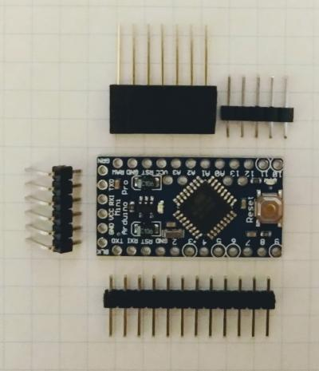
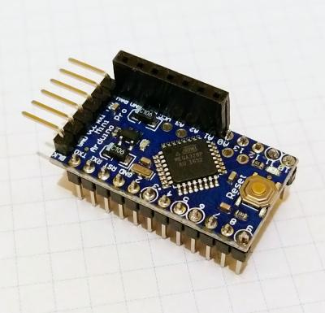
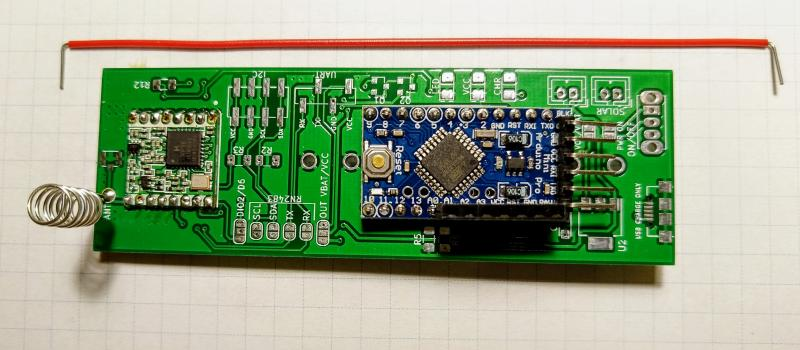
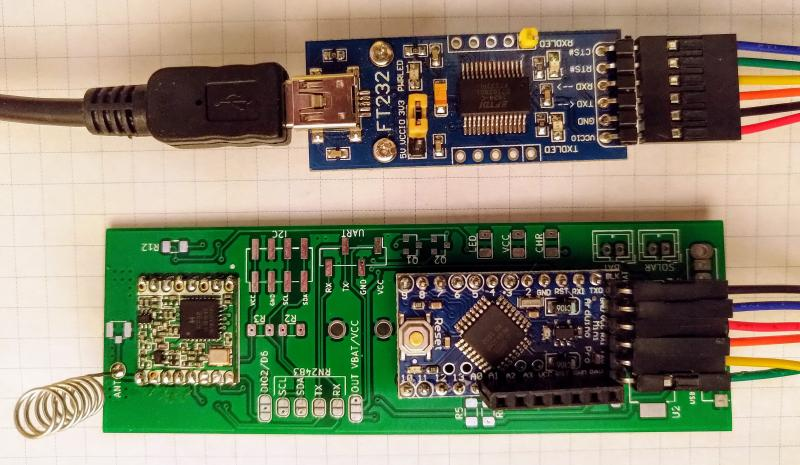
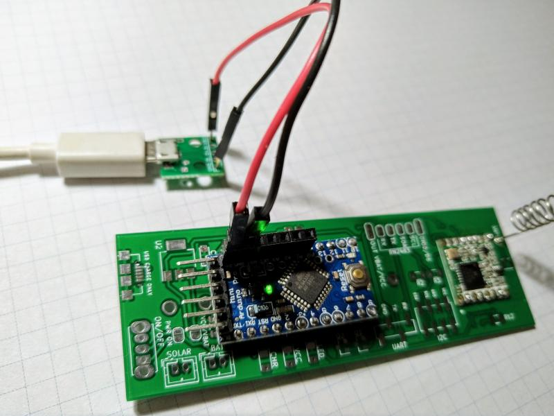

# Wersja minimalna urządzenia

Wersja minimalna urządzenia jest najłatwiejsza do zbudowania dla początkującego użytkownika. 
Wymaga zastosowania zewnętrznego zasilacza USB podłączonego bezpośrednio do Arduino. Ponieważ wykorzystuje 
stabilizator napięcia wbudowany w Arduino Pro Mini, można pominąć montaż na płytce dodatkowych komponentów SMD.

> *Do zbudowana wersji minimalnej można użyć płytki w wersji 1.0 lub 1.1*

## Wymagane elementy

| Nr| Element | Ilość | Uwagi |
|-------|---------|-------|-------|
|1|Moduł micro USB|1| Umożliwia zastosowanie standardowego zasilacza USB 5V|
|2|Konwerter USB-UART|1| Konieczny do wgrania oprogramowania do Arduino|
|3|RFM95W|1| Moduł nadawczo-odbiorczy LoRa 868 MHz|
|4|Arduino Pro Mini|1| Wersja 3.3V|


## Lista czynności

1. Zamówienie PCB
2. Podłączenie Arduino Pro Mini
3. Podłączenie RFM95W i anteny
4. Rejestracja urządzenia w sieci LoRaWAN The Things Network
5. Kompilacja programu
6. Wgrywanie programu
7. Podłączenie zasilania i uruchomienie

### Zamówienie PCB

DO UZUPEŁNIENIA

### Podłączenie Arduino Pro Mini

Wykorzystane gniazda i listwy typu goldpin



Arduino z wlutowanymi goldpinami



### Podłączenie RFM95W i anteny

Płytka z przylutowanym modułem RFM95 i anteną helikalną. Antena wykonana zgodnie z opisem zamieszczonym na blogu http://e.pavlin.si/2018/06/29/small-normal-mode-antenna-for-868mhz/ (powyżej płytki przewód do płytki stykowej wykorzystany do zrobienia anteny). Zamiast anteny helikalnej można przylutować prosty przewód lub drucik długości 8,7cm.



### Rejestracja urządzenia w sieci LoRaWAN The Things Network

Przed przystąpieniem do kompilowania przykładowego programu i wgraniem go do urządzenia, musimy to urządznie zarejestrować u wybranego dostawcy sieci LoRaWAN - w tym przypadku The Things Network.

Proces rejestracji jest dobrze opisany w [dokumentacji The Things Network](https://www.thethingsnetwork.org/docs/devices/registration.html) - pamiętajmy o wybraniu metody aktywacji ABP. 

### Kompilacja programu

DO UZUPEŁNIENIA

Przypisane urządzeniu w trakcie rejestracji wartości `Device Address`, `Network Session Key`, oraz `App Session Key` należy wpisać do kodu szablonu poniżej linii `// ABP mode - set DevAddr and session keys`:

|Nazwa w Device Settings|Nazwa zmiennej w szablonie|
|---|---|
|Device Address|DEVADDR|
|Network Session Key|NWKSKEY|
|App Session Key|APPSKEY|

```
//...

// ------- LoRaWAN configuration

// ABP mode - set DevAddr and session keys
static const PROGMEM u1_t NWKSKEY[16] = { 0x11, 0x09, 0xAD, 0x04, 0x4C, 0x4F, 0xB7, 0xA5, 0x2D, 0x86, 0xF7, 0x2E, 0xD0, 0xDD, 0x5B, 0x3B };
static const PROGMEM u1_t APPSKEY[16] = { 0xE0, 0xD8, 0x4F, 0xEE, 0xC3, 0x7C, 0xC9, 0x9B, 0xD3, 0xF2, 0x03, 0x61, 0xE4, 0xF2, 0x5B, 0xFE };
static const u4_t DEVADDR = 0x2601108E;

// ...
```

### Wgrywanie programu (szkicu)

Do wgrania skompilowanego programu na Arduino konieczne będzie podłączenie go z wykorzystaniem konwertera USB-UART.

Sposób połączenia pinów konwertera z pinami Arduino pokazany w tabeli poniżej (w nawiasach alternatywne oznaczenia, które można spotkać na niektórych konwerterach). Nie należy sugerować się na kolejnością w tabeli, tylko sprawdzić napisy na płytkach - nowsze wersje Arduino Pro Mini mają odwrotną kolejność pinów niż starsze.

|Adruino Pro Mini|FT232|
|---|---|
|BLK|GND|
|GND|CTS (CTS#)|
|VCC|VCC|
|RXI|TXD|
|TXD|RXD|
|GNR|DTR (RTX#)|

>**Uwaga! Należy pamiętać o odpowiednim ustawienie na FT232 zworki 3.3v/5V  w pozycji 3.3V - zgodnie z używaną w tym przykładzie wersją Arduino**



Z menu Arduino IDE wybieramy opcję `Szkic > Wgraj` i czekamy na wyświetlenie się komunikatu o zakończeniu procesu wgrywania programu do Arduino.

### Podłączenie zasilania i uruchomienie

Jeśli kompilacja i wgranie programu zakończyło się bez błedu, możemy odłączyć konwerter USB-UART od Arduino.

Podłaczamy zasilacz USB 5V, korzystając z Modułu Micro USB połączonego z pinami Arduino jak na ilustracji poniżej. Przewody z modułu USB wpinamy w gniazda RAW (5V) oraz GND Arduino.


