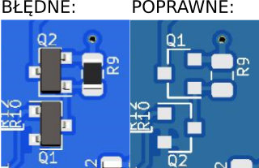

# v2.0

# Spis treści:
1. [Opis płytki](#Opis-płytki)
2. [Bootloader](#Bootloader)
3. [Interfejs LoRaWAN](#Interfejs-LoRaWAN)
4. [Układ zasilania](#Układ-zasilania)
5. [Układ ładowania](#Układ-ładowania)
6. [Diody LED](#Diody-LED)
7. [Interfejsy komunikacyjne](#Interfejsy-komunikacyjne)
8. [Złącza zasilania](#Złącza-zasilania)
9. [Pomiar napięcia baterii](#Pomiar-napięcia-baterii)
10. [Sterowanie zasilaniem układów zewnętrznych](#Sterowanie-zasilaniem-układów-zewnętrznych)
11. [Lista elementów](#Lista-elementów)
12. [Uwagi](#Uwagi)

# Opis płytki
Platforma deweloperska oparta na mikrokontrolerze ATMega328p. Na płytce znajduje się konwerter USB-UART dzięki czemu nie są wymagane dodatkowe układy komunikacyjne do programowania.
Do komunikacji z siecią LoRaWAN służy moduł RN2483.

## Bootloader
TODO

## Interfejs LoRaWAN
Płytka pozwala na realizację interfejsu LoRaWAN za pomocą modułu z wbudowaną obsługą stosu LoRaWAN [RN2483A](https://www.microchip.com/wwwproducts/en/RN2483) - komunikacja z modułem poprzez port szeregowy obsługiwany programowo przez piny 10 (RX) i 11 (TX) mikrokontrolera ATMega328p (odpowiednio piny 6 i 7 zgodnie z Arduino Pro Mini).

## Układ zasilania
Zastosowany regulator napięcia LDO [AP2112K-3.3TRG1](https://cdn-shop.adafruit.com/product-files/2471/AP2112.pdf).
* Maksymalne napięcie zasilania - 6V
* Minimalne napięcie zasilania - 2.5V
* Spadek napięcia dla prądu 10mA - 5mV, 300mA - 125mV, 600mA - 250mV
* Napięcie wyjściowe - 3.3V
* Prąd maksymalny - 1A

## Układ ładowania
Zastosowany kontroler ładowania akumulatorów litowo-polimerowych (Li-Po) i litowo-jonowych (Li-Ion) [MCP73831](https://www.microchip.com/wwwproducts/en/en024903#additional-features).
* Maksymalne napięcie zasilania - 6V
* Minimalne napięcie zasilania - 3.75V
* Napięcie ładowania - 4.2V
* Prąd ładowania reguluje się przez dobranie R1, dla 2k&#x2126; - 500mA, 4k&#x2126; - 250mA

## Diody LED
|Oznaczenie|Opis|
|:--------:|:---|
|T/R|dioda sygnalizująca komunikację USB-ATMEGA|
|CHR|sygnalizuje ładowanie podłączonej baterii Li-Po/Li-Ion|
|VCC|sygnalizuje obecność napięcia zasilania|
|LED|dioda do ogólnego zastosowania w aplikacji użytkownika (`USER_LED`)|

## Interfejsy komunikacyjne
Do podłączenia zewnętrznych czujników dostępne są interfejsy:
* I2C (na magistrali wlutowane są rezystory podciągające)
* port szeregowy obsługiwany programowo (z wykorzystaniem biblioteki `SoftwareSerial`) na pinach 12 (RX) i 13 (TX) ATMega328p (odpowiednio piny 8 i 9 zgodnie z Arduino Pro Mini).

## Złącza zasilania
Do płytki możemy podłączyć źródło zasilania:
* USB - złącze USB pełni funkcje zasilania płytki, źródła ładowania baterii oraz komunikację z mikrokontrolerem.
* BATTERY - złącze baterii/akumulatorów Li-Po/Li-Ion 3,6V, do złącza podłczony jest kontoler ładowania akumulatorów.
* KOSZYK - miejsce na koszyk baterii/akumulatorów Li-Po/Li-Ion o rozmiarze AA (14500) 3,6V, do złącza podłczony jest kontoler ładowania akumulatorów.
* SOLAR - może służyć jako źródło zasilania, ale najlepiej można go wykorzystać wraz z ogniwem jako źródło ładowania akumulatora. Należy wykorzystać panel o napięciu 5,5V.

> **UWAGA!** Przy wykorzystaniu baterii litowych (FR6) nie ładowalnych należy wylutować kontroler ładowania akumulatorów U4.

## Pomiar napięcia baterii
Wykorzystane wejście analogowe A0 i dzielnik napięcia R4, R5 (makro `VBAT`).

## Sterowanie zasilaniem układów zewnętrznych
Układ sterowania jest złożony z dwóch tranzystorów. Pierwszy tranzystor NPN BC817 jest wysterowany z mikrokontrolera i wykorzystany jest do kluczowania drugiego tranzystora. Tranzystor polowy z kanałem typu P pozwala na sterowanie zasilaniem zewnętrznego urządzenia. Wybór zasilania dla zewnętrznego urządzenia dokonuje się zworką JP5(BATT/VEXT). Możemy zasilać urządzenie z stabilizowanego zasilania 3.3V lub zasilanie podać z zewnątrz (lub innego punktu), wymaga to podłączenia napięcia na pad VEXT oraz rozcięcie zworki JP5 i zalutowaniu jej w pozycji EXT. Zastosowany tranzystor polowy YJL2301F pozwala na obciążenie do 2A z źródła zewnętrznego oraz 600mA z VCC (ograniczenia wynikają z parametrów LDO). 

# Lista elementów
TODO

# Uwagi
Na pierwszych wersjach płytki pojawił się błąd w opisie elementów Q1 i Q2. Każdy kto otrzyma taką wersję płytki zostanie o tym poinformowany.
